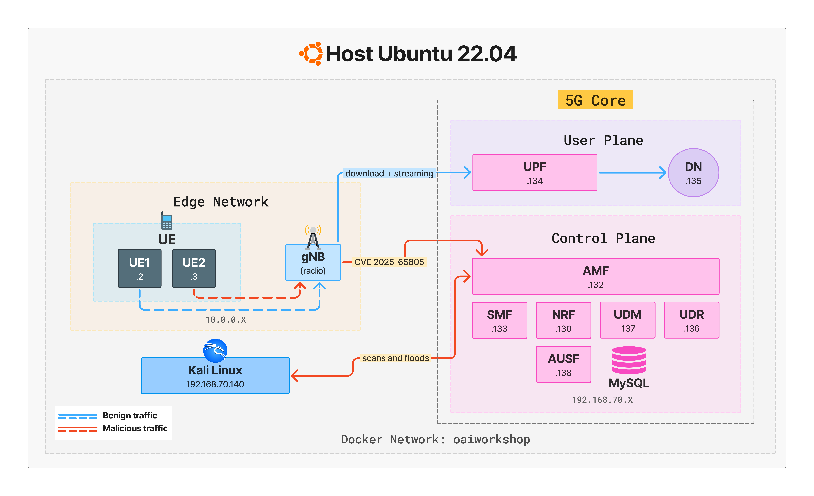

# 5G Core Network Cyberattacks Dataset (CVE5G)

This repository contains the infrastructure and automation scripts to generate a novel network traffic dataset from a 3GPP-compliant 5G emulation based on the OpenAirInterface (OAI) framework.

## Architecture

The 5G Core and access network are orchestrated as Docker containers. The environment captures multi-layer traffic scenarios, integrating:
1. **Realistic Benign Traffic:** traffic generated through large file transfers (TCP) and adaptive HTTPS video streaming using `yt-dlp`.
2. **Conventional Cyberattacks:** TCP SYN, UDP, and ICMP flooding attacks launched from a dedicated Kali Linux node.
3. **Core Vulnerability Exploitation:** exploitation of the documented vulnerability CVE-2025-65805.



## Experimental Scenarios

The traffic generation is fully automated and temporally organized into three scenarios:
* **Scenario 1:** Benign baseline traffic only.
* **Scenario 2:** Sequential attacks with irregular intervals.
* **Scenario 3:** Overlapping attacks.


## Execution Guide

### Prerequisites
* Linux x86_64 Host
* Docker Engine & Docker Compose plugin
* `tshark` installed (`sudo apt-get install tshark`)

### Method 1: Automated Pipeline (Recommended)
The easiest way to generate the dataset is using the automated pipeline. It will validate requirements, start the Core and RAN, generate the selected traffic scenario, and safely tear down the environment.

From the root directory, simply run:
```bash
# Run Scenario 2 (default)
sudo ./scripts/run_pipeline.sh

# Or specify a different scenario and exploit method:
SCENARIO=3 CVE_METHOD=python sudo -E ./scripts/run_pipeline.sh
```

### Method 2: Manual Step-by-Step (Under the Hood)

If you prefer to maintain the network active for debugging or manual inspection, follow these steps:

#### 1. Clean the environment
Ensure no residual networks or containers are running:
```bash
docker compose -f docker-compose-ran.yml down
docker compose -f docker-compose.yml down

```

#### 2. Start the 5G Core

Bring up the database and the 5G Core functions:

```bash
docker compose -f docker-compose.yml up -d mysql
docker compose -f docker-compose.yml up -d
sleep 15

```

#### 3. Start the RAN

Bring up the gNB antenna and the User Equipment (UE1 and UE2):

```bash
docker compose -f docker-compose-ran.yml up -d
sleep 15

```

#### 4. Generate the Dataset

Execute the traffic generation script. You can choose the scenario (`1`, `2`, or `3`) and the CVE exploitation method (`python`, `ueransim`, or `none`).

**Example: Running Scenario 2 with UERANSIM exploit**

```bash
SCENARIO=2 CVE_METHOD=ueransim sudo -E ./scripts/02_generate_traffic.sh

```

### Expected Outputs

Upon completion (default 300 seconds), the script will generate the following artifacts in the `results/scenario_X/` directory:

* `cve5g_sX_raw.pcap`: Full packet capture.
* `cve5g_sX_filtered.pcap`: Filtered capture containing only 5G signaling and data planes (`http2`, `ngap`, `pfcp`, `gtp`).
* `cve5g_sX_labels.csv`: Ground-truth labels with timestamps and IP addresses for ML model training.
* `amf_crash_sX.log`: Proof of DoS success.